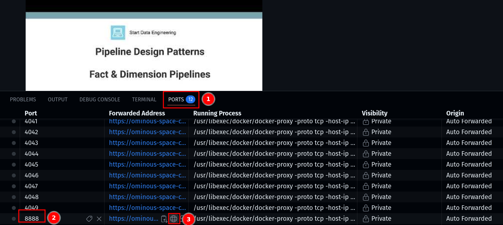

Code for blog at > [StartDataEngineering](https://www.startdataengineering.com/)

## Setup 

Create an account at [OpenCode Zen](https://opencode.ai/auth) to use it as an LLM provider.

> [!IMPORTANT]
> Enter your OpenCode API key at [.env.template](./.env.template) and rename the file to `.env`

If you already use an LLM provider, see how to use that with [pi agent](https://pi.dev/docs/latest/providers).

### Local Setup (Recommended)

**Prerequisites**

1. [git](https://git-scm.com/book/en/v2/Getting-Started-Installing-Git)
2. [Docker](https://docs.docker.com/engine/install/) and [Docker Compose](https://docs.docker.com/compose/install/)

**Windows users**: Please use WSL and Install Ubuntu using this [document](https://documentation.ubuntu.com/wsl/stable/howto/install-ubuntu-wsl2/#). In your ubuntu terminal install the prerequisites above.

Clone the repo & start the containers as shown below.

```bash 
git clone https://github.com/josephmachado/building-data-pipelines-with-ai.git
cd building-data-pipelines-with-ai
docker compose up -d --build
sleep 30 # sleep 30 seconds to wait for the container and its services to fully start
```

#### Running code 

Open Jupyter Lab at [http://localhost:8888](http://localhost:8888)

Open workshop notebook at [./notebooks/workshop.ipynb](./notebooks/workshop.ipynb)

### CodeSpaces Setup

**Prerequisites**

1. [GitHub Account](https://github.com/)

[](https://codespaces.new/josephmachado/building-data-pipelines-with-ai)

Then start docker containers via the terminal as shown below.

```bash 
docker compose up -d --build
sleep 30 # sleep 30 seconds to wait for the container and its services to fully start
```

> [!NOTE]
> The first docker build will take a while to complete, about 10 min

Open notebook at [./notebooks/workshop.ipynb](./notebooks/workshop.ipynb) by opening the `8888` port as shown in the screenshot below.



#### Switch off codespaces 

> [!CAUTION]
> Do not forget to stop your codespaces machine

## Troubleshooting 

> [!WARNING]
> 
> If you find an error when doing `just up`. It is likely due to this repo using an old Spark version. Go to [Dockerfile](./Dockerfile) and update the `RUN wget ` to use the dlcn version.
